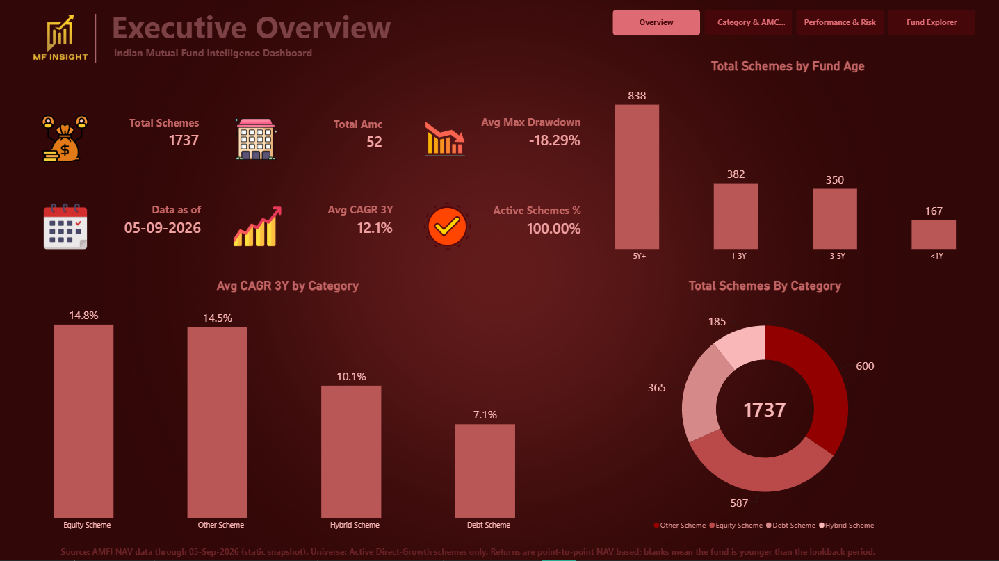

# Indian Mutual Fund Intelligence

An end-to-end analytics project: a compiled AMFI NAV dataset → DuckDB → validated analytical tables → a 4-page Power BI dashboard covering the Indian mutual fund market.

**Stack:** Python · DuckDB · SQL (window functions) · Parquet · Power BI · DAX · Power Query (M)
**Data through:** 05-Sep-2026 (static snapshot)
**Analysed universe:** 1,737 Active Direct-Growth schemes · 52 AMCs



---

## Contents

1. [Objective](#objective)
2. [Dashboard](#dashboard)
3. [Data source](#data-source)
4. [Pipeline](#pipeline)
5. [Metric definitions](#metric-definitions)
6. [Data validation](#data-validation)
7. [Power BI layer](#power-bi-layer)
8. [Challenges and fixes](#challenges-and-fixes)
9. [What I learned](#what-i-learned)
10. [Known limitations](#known-limitations)
11. [Reproduce](#reproduce)
12. [Repository structure](#repository-structure)
13. [Credits](#credits)

---

## Objective

Answer practical questions about the Indian mutual fund market from raw NAV data:

- How is the fund universe structured across categories and AMCs?
- How do return and risk compare across categories?
- How does fund age limit what can be measured?
- How does a single fund compare with its category over 1Y, 3Y and 5Y?

---

## Dashboard

| Page | What it shows |
|---|---|
| **Executive Overview** | Scheme and AMC counts, average 3Y CAGR, average maximum drawdown, schemes by fund age and category |
| **Category & AMC Landscape** | Scheme mix by category, AMCs ranked by scheme count, top-10 AMC table with average 3Y CAGR |
| **Performance & Risk** | Category return comparison, return-vs-volatility scatter, top schemes by return/volatility ratio, 3Y vs 5Y CAGR by category |
| **Fund Explorer** | Single-fund profile: return, CAGR, volatility, drawdown, category rank, and fund-vs-category return by horizon |

| Category & AMC | Performance & Risk | Fund Explorer |
|---|---|---|
|  |  |  |

---

## Data source

**Chain of origin:** AMFI official NAV files → compiled and enriched by the **MFPro NAV Master** (Amar Harolikar, TIGZIG) → this project.

| Item | Detail |
|---|---|
| Origin | AMFI (Association of Mutual Funds in India) official NAV files |
| Compiled dataset | MFPro NAV Master: https://www.tigzig.com/mfpro/data-dictionary |
| NAV history | `amfi_nav_master.parquet`: one row per scheme per day, April 2006 onward (`scheme_code`, `date`, `nav`, `scheme_name`, `isin`) |
| Scheme master | `amfi_nav_master_latest.csv`: 38,194 rows × 22 columns; one row per scheme (identifiers, category, plan, option, dates, flags, latest quarterly AAUM, latest NAV) |
| Source coverage | 38,000+ schemes (about 8,600 active), 71 AMCs, 37M+ NAV rows |
| Obtained via | The dataset's public bulk-download endpoint |
| This project | 2,875,293 NAV rows; 03-Apr-2006 to 05-Sep-2026 |
| Terms | `[CHECK https://www.tigzig.com/terms and state the licence or attribution requirement here]` |

**How the universe was defined.** The scheme master lists about 38,000 rows because every fund is issued as separate Regular/Direct and Growth/IDCW/Bonus variants, each with its own `scheme_code`. Restricting to **Active + Direct + Growth** keeps one variant per fund and keeps returns comparable. Of 1,757 schemes that met the filter, **1,737 were analysed** after the exclusion described in [Data validation](#data-validation). Because one scheme code is one plan-and-option variant, scheme count here is close to a fund count.

**Field definitions** (from the MFPro data dictionary; these are derived fields added by the dataset's author, so their classification logic is inherited, not independently verified):

| Field | Meaning |
|---|---|
| `is_active` | TRUE if the scheme published a NAV within the last 45 days |
| `is_stale` | TRUE only for ~50 schemes with just 1 to 2 NAV rows in AMFI's records (data orphans). It does **not** mean an outdated NAV |
| `category_group_clean` | Four groups: Equity, Debt, Hybrid, Other. Fund of Funds and Solution Oriented schemes sit under **Other** |
| `scheme_plan` / `scheme_option` | Direct / Regular / Other, and Growth / IDCW / Bonus / Other, classified from the scheme name |
| `aaum_cr_quarterly_avg` | Latest quarterly **average** AUM in ₹ crore, not point-in-time |

---

## Pipeline

```
NAV parquet ──┐
              ├─► DuckDB ─► validated join ─► fund_universe ─► daily returns
scheme CSV ───┘                                                   │
                                                                  ▼
Power BI ◄─ Parquet exports ◄─ analytics tables ◄─ discontinuity exclusion
```

| Step | Script | Purpose |
|---|---|---|
| 1 | `inspect_mf_data.py`, `inspect_scheme_master.py` | Profile raw files: shape, dtypes, nulls, duplicates, memory |
| 2 | `build_model.py` | `nav_master` view (`TRY_CAST` NAV to `DECIMAL(18,4)`) and `scheme_master` table; `scheme_code` uniqueness check; NAV-to-scheme match check; index on `scheme_code` |
| 3 | `profile_scheme_master.py` | Profile AMCs, plans, options, categories, active status |
| 4 | `create_fund_universe.py` | Filter to `is_active = TRUE`, `scheme_plan = 'Direct'`, `scheme_option = 'Growth'` |
| 5 | `create_daily_returns.py` | `fund_daily_returns`: daily return from `LAG(nav)` per scheme; null and non-positive NAVs removed first |
| 6 | `flag_nav_discontinuities.py` | Detect ×10 / ×100 / ÷10 / ÷100 NAV breaks; write `nav_discontinuities` and `excluded_schemes` |
| 7 | `run_analysis.py` | Builds a clean view excluding flagged schemes, then: performance summary, risk metrics, drawdowns, `fund_analytics`, annual and monthly returns, category and AMC summaries; exports Parquet |
| 8 | `add_fund_age_tier.py` | Adds `fund_age_tier` (<1Y, 1-3Y, 3-5Y, 5Y+) |
| 9 | `check_database.py`, `check_columns.py`, `check_nesting.py` | Validation checks |

**SQL techniques used:** `LAG()` for daily returns; running `MAX() OVER (... ROWS BETWEEN UNBOUNDED PRECEDING AND CURRENT ROW)` for drawdowns; correlated subqueries for the last NAV on or before each lookback date; `FIRST_VALUE`/`LAST_VALUE` for annual and monthly returns; CTE chains; `STDDEV_SAMP`.

---

## Metric definitions

| Metric | Definition |
|---|---|
| Daily return | `nav / previous_nav − 1` |
| 1Y return | `latest NAV / NAV one year earlier − 1` (absolute, not annualised) |
| 3Y / 5Y / 10Y CAGR | `(latest NAV / NAV n years earlier)^(1/n) − 1`, using the last available NAV on or before the lookback date |
| Annualised volatility | `STDDEV_SAMP(daily_return) × √252` |
| Downside deviation | `√AVG(daily_return² where daily_return < 0)` × √252 |
| Maximum drawdown | `MIN(nav / running_peak − 1)` over full history |
| Return/volatility ratio | Return divided by annualised volatility |
| Fund age tier | Days from `first_date` to run date, banded at 1, 3 and 5 years |

---

## Data validation

Validity was treated as part of the build.

**Checks**

- **Key uniqueness:** `scheme_code` duplicates in the scheme master
- **Referential integrity:** every NAV row matched to the scheme master; unmatched rows counted
- **Return hygiene:** null and non-positive NAVs removed before returns
- **Missing-value nesting:** a fund with a 5Y CAGR must also have a 3Y CAGR and 1Y return (`check_nesting.py`, expects 0 violations)
- **Age reconciliation:** funds without a 1Y return reconciled against the `<1Y` age tier (167 schemes)
- **NAV continuity:** flags any single-day NAV ratio near ×10, ×100, ÷10 or ÷100
- **Exclusion proof:** after `run_analysis.py`, the number of excluded schemes present in `fund_analytics` is asserted to be 0

**What the continuity check found**

| | |
|---|---|
| Break events | 21 |
| Schemes affected | 20 of 1,757 (1.14%) |
| Break types | 18 × ×100 schemes, plus one ÷100, one ×10 and one ÷10 event |
| Fund types affected | Liquid, overnight, money market, ultra-short, short-term, corporate bond and gilt funds |
| Treatment | Excluded from all return and risk metrics |
| Result | 1,737 schemes analysed; 2,875,293 NAV rows |

Examples: the ICICI Prudential Overnight Fund NAV moved from 116.47 to 1,164.89 on 17-Aug-2022 (exactly +900.14%); Navi Liquid Fund moved ×100 in September 2014 and ÷100 in November 2022. The pattern is consistent with face-value changes (₹10 → ₹1,000) not rebased in the NAV series. I could not determine whether the discontinuities originate in AMFI's own history or in the compiled dataset, so they are described as *present in the NAV series*.

---

## Power BI layer

**Power Query (M):** the model reads `investor_fund_dataset.parquet` from the processed folder, and a filter step drops the 20 flagged scheme codes.

```m
ExcludeBadSchemes = Table.SelectRows(
    #"Changed Type",
    each not List.Contains(
        {119091, 119092, 119110, 119164, 119746, 119766, 119861, 120249, 120304,
         120497, 120507, 120520, 120541, 120560, 120785, 140196, 145486, 145536,
         147606, 147837},
        [scheme_code]
    )
)
```

**DAX (Fund Explorer horizon comparison):** fund and category-average return at 1Y, 3Y and 5Y, guarded so funds younger than the horizon return blank.

```dax
Fund CAGR by Horizon =
VAR SelHorizon = SELECTEDVALUE ( HorizonLookup[Horizon] )
VAR LatestNav  = SELECTEDVALUE ( processed[latest_nav] )
VAR Nav1Y      = SELECTEDVALUE ( processed[nav_1y_ago] )
VAR Nav3Y      = SELECTEDVALUE ( processed[nav_3y_ago] )
VAR Nav5Y      = SELECTEDVALUE ( processed[nav_5y_ago] )
RETURN
SWITCH (
    SelHorizon,
    "1Y", IF ( NOT ISBLANK ( Nav1Y ), DIVIDE ( LatestNav, Nav1Y ) - 1 ),
    "3Y", IF ( NOT ISBLANK ( Nav3Y ), POWER ( DIVIDE ( LatestNav, Nav3Y ), 1 / 3 ) - 1 ),
    "5Y", IF ( NOT ISBLANK ( Nav5Y ), POWER ( DIVIDE ( LatestNav, Nav5Y ), 1 / 5 ) - 1 ),
    BLANK ()
)
```

`Category Avg CAGR by Horizon` uses the same logic inside `AVERAGEX` over the selected fund's category with `ALL(processed)` and a category filter. The 1Y point is an absolute return while 3Y and 5Y are CAGRs, and the chart is labelled accordingly.

---

## Challenges and fixes

**1. An overnight fund with a 67.5% five-year CAGR.**
The first build showed ICICI Prudential Overnight Fund as the top 5Y performer at 67.51%. An overnight fund cannot compound at that rate. Tracing it found a 10× NAV jump in one day; a universe-wide scan found 18 further schemes with ~99× jumps. I used a ratio-based detector (×10, ×100, ÷10, ÷100) rather than a blunt "large daily move" threshold, so genuine large moves are not swept out, and excluded affected schemes instead of rescaling them, since a rescale assumes a pure unit change with no real return on the break day. The same breaks would also have corrupted maximum drawdown (a ÷100 break registers as −99%) and volatility.

**2. Stale paths after moving the project.**
The project moved from a `C:` Desktop folder to an `A:` drive, breaking hard-coded paths in scripts and in the Power BI source. Scripts now derive paths from their own location, and the Power Query source was repointed.

**3. Dashboard and pipeline out of sync.**
After the pipeline was fixed, the file Power BI reads still held the old data (1,757 schemes, top 5Y CAGR 0.675), so a refresh would have succeeded and shown the same wrong numbers. I queried the parquet directly to confirm, then applied the exclusion in Power Query.

**4. A chart plotting −100% for young funds.**
`POWER(BLANK, 1/5) − 1` evaluates to −1, because DAX treats the blank as zero. Every fund without a 5-year NAV appeared at −100%, and the category average inherited it. Fixed with explicit `ISBLANK` guards, so funds younger than the horizon are blank, and by storing decimals with percentage formatting to match every other metric.

**5. Reading the source correctly.**
I first assumed `is_stale` meant an outdated NAV. The data dictionary showed it marks ~50 orphan schemes with 1 to 2 NAV rows, so the "Stale %" KPI I had planned would have been meaningless. Reading the dictionary also explained why the "Other Scheme" category performs so well: it holds gold, silver and overseas funds of funds.

**6. Display details.**
A card abbreviated 1,737 to "2K" (display-units setting), and category counts were re-checked against the post-exclusion universe.

---

## What I learned

- A pipeline that runs cleanly can still produce a wrong headline number. Asking "is this plausible for this fund type?" caught what no error message did.
- Look at the shape of an anomaly first. Exact ratios of 10 and 100 point to unit changes, not noise, and "jumps and stays" needs a different treatment from "jumps and reverts".
- Exclude and disclose rather than silently repair, when the cause can't be verified.
- A successful refresh is not proof the data is right. Verify what the BI tool actually reads.
- DAX treats blanks as zero in arithmetic; missing inputs need explicit guards.
- Read the data dictionary before defining KPIs. Field names can mean something different from what they suggest.
- Window functions carry most of the financial logic in SQL.

---

## Known limitations

- **Static snapshot** through 05-Sep-2026; no scheduled refresh. A fresh download will differ
- **Scope:** Direct-Growth only; Regular plans, IDCW and Bonus options excluded
- **Survivorship bias:** only active schemes; matured and merged funds are absent, which skews averages upward
- **Exclusion applied in Power Query.** The 20 flagged schemes are listed in `excluded_schemes` in the DuckDB build, but `investor_fund_dataset.parquet` still contains them and the filter is applied in the BI layer. Other exported Parquet files reflect the clean pipeline
- **Point-to-point returns:** no benchmark or risk-free rate, so no alpha, beta, tracking error or Sharpe ratio
- **Mixed definitions:** the Fund Explorer compares a 1Y absolute return with 3Y/5Y CAGRs
- **"Other Scheme" is not an asset class.** It holds Fund of Funds (gold, silver, international) and Solution Oriented funds, so its average CAGR reflects those strong-performing segments
- **Category framework in transition:** SEBI reissued categories on 26-Feb-2026 and fund houses were re-filing through August 2026, so sub-category names mix old and new; analysis uses the four-group field only
- **Return/volatility ratio** is inflated for very low-volatility funds (arbitrage, short duration)
- **Blank CAGR** means the fund is younger than the lookback, not missing data
- Volatility annualised on a 252-day convention; AAUM is a quarterly average, not point-in-time; fund age tiers use the run date, so boundary cases can shift

---

## Reproduce

```bash
pip install duckdb pandas pyarrow
```

1. Download the two source files (see [Data source](#data-source)) into `data/raw/`
2. Run in order:

```bash
python build_model.py
python create_fund_universe.py
python create_daily_returns.py
python flag_nav_discontinuities.py
python run_analysis.py
python add_fund_age_tier.py
python check_nesting.py
```

3. Open the `.pbix` and point the Power Query source at `data/src/processed/`

Some scripts still contain absolute Windows paths and need editing for your folder.

---

## Repository structure

```
├── data/
│   ├── raw/                 # NAV parquet, scheme master CSV
│   └── src/
│       ├── database/        # mutual_funds.duckdb
│       └── processed/       # analytics parquet files for Power BI
├── scripts/                 # pipeline and validation scripts
├── images/                  # dashboard screenshots
└── README.md
```

---

## Credits

Data: **MFPro NAV Master** by Amar Harolikar (TIGZIG), compiled from AMFI's official files: https://www.tigzig.com/mfpro/data-dictionary

---

## Author

**Samyak Prabhulkar**: BE Information Technology (Data Science honours), Mumbai
[LinkedIn](#) · [GitHub](#)