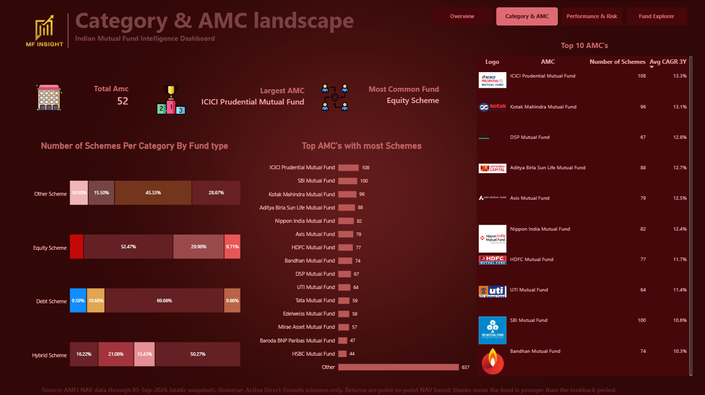
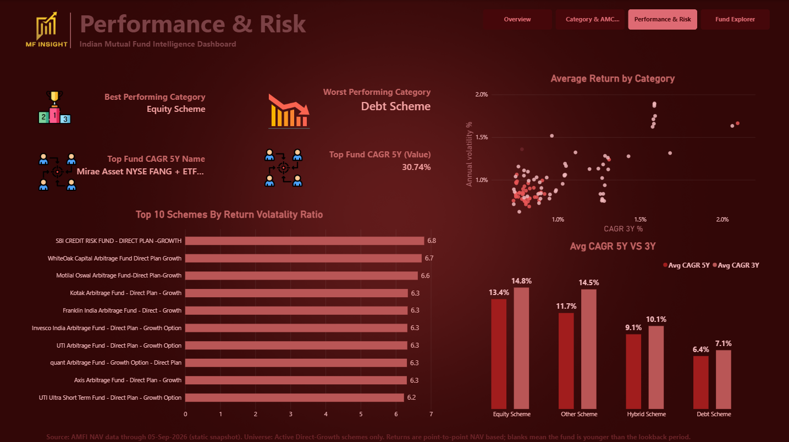
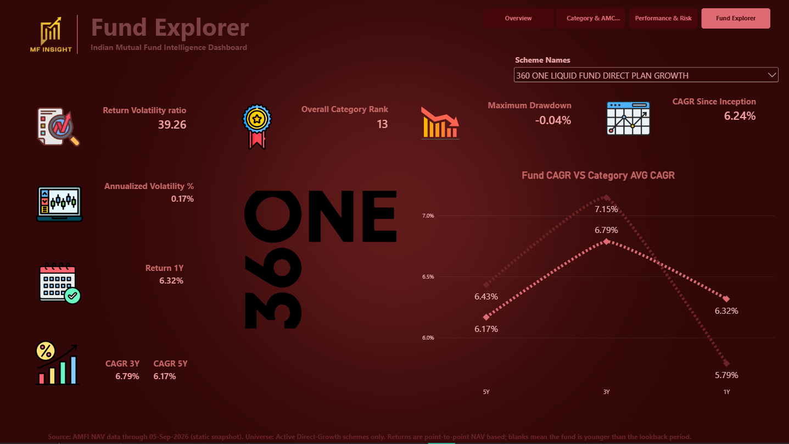

# Indian Mutual Fund Intelligence

An end-to-end data analytics project that transforms compiled **AMFI mutual fund NAV data** into validated analytical datasets and an interactive **Power BI dashboard** for analysing the Indian mutual fund market.

The project covers data profiling, DuckDB-based modelling, SQL analytics, return and risk calculations, NAV anomaly detection, validation, Parquet exports, and Power BI visualisation.

**Data through:** 05-Sep-2026 · Static snapshot
**Analysed universe:** 1,737 Active Direct-Growth schemes · 52 AMCs


---

## Contents

1. [Project Overview](#project-overview)
2. [Dashboard](#dashboard)
3. [Technology Stack](#technology-stack)
4. [Data Source](#data-source)
5. [Pipeline](#pipeline)
6. [Metric Definitions](#metric-definitions)
7. [Data Validation](#data-validation)
8. [Power BI Layer](#power-bi-layer)
9. [Challenges and Fixes](#challenges-and-fixes)
10. [Key Learnings](#key-learnings)
11. [Known Limitations](#known-limitations)
12. [Reproduce](#reproduce)
13. [Repository Structure](#repository-structure)
14. [Credits](#credits)
15. [Author](#author)

---

## Project Overview

The objective was to build a reproducible analytics pipeline that answers practical questions about the Indian mutual fund market:

* How is the fund universe distributed across categories and AMCs?
* How do returns and risk differ across fund categories?
* How does fund age affect the availability of performance metrics?
* How does an individual fund compare with its category over 1Y, 3Y and 5Y?
* Are abnormal NAV movements affecting return and risk calculations?
* Can the entire analytical workflow be validated before the data reaches Power BI?

The project intentionally separates **data preparation, analytical modelling, validation and visualisation** so that the Power BI layer is based on a controlled analytical dataset rather than raw NAV files.

---

## Dashboard

The Power BI report contains four analytical pages.

| Page                         | What it shows                                                                                                         |
| ---------------------------- | --------------------------------------------------------------------------------------------------------------------- |
| **Executive Overview**       | Scheme and AMC counts, average 3Y CAGR, average maximum drawdown, schemes by fund age and category                    |
| **Category & AMC Landscape** | Scheme distribution by category, AMC ranking by scheme count, and average 3Y CAGR                                     |
| **Performance & Risk**       | Category return comparison, return-vs-volatility analysis, top schemes by return/volatility ratio, and 3Y vs 5Y CAGR  |
| **Fund Explorer**            | Individual fund profile including returns, CAGR, volatility, drawdown, category rank, and fund-vs-category comparison |

### Executive Overview


### Category & AMC Landscape



### Performance & Risk



### Fund Explorer



---

## Technology Stack

| Technology          | Purpose                                                             |
| ------------------- | ------------------------------------------------------------------- |
| **Python**          | Data preparation, profiling, validation and pipeline orchestration  |
| **DuckDB**          | Analytical database and SQL processing                              |
| **SQL**             | Window functions, returns, drawdowns, risk metrics and aggregations |
| **Parquet**         | Efficient analytical data storage and Power BI input                |
| **Power BI**        | Interactive dashboard and visual analytics                          |
| **DAX**             | Dynamic measures and Fund Explorer calculations                     |
| **Power Query (M)** | Data transformation and exclusion logic                             |

---

## Data Source

### Chain of Origin

**AMFI official NAV files → MFPro NAV Master → this project**

The project uses the **MFPro NAV Master** compiled by Amar Harolikar (TIGZIG), which is derived from AMFI's official NAV files.

| Item                   | Detail                                                                         |
| ---------------------- | ------------------------------------------------------------------------------ |
| **Origin**             | AMFI (Association of Mutual Funds in India) official NAV files                 |
| **Compiled dataset**   | MFPro NAV Master                                                               |
| **NAV history**        | `amfi_nav_master.parquet`                                                      |
| **Scheme master**      | `amfi_nav_master_latest.csv`                                                   |
| **Source coverage**    | 38,000+ schemes, approximately 8,600 active schemes, 71 AMCs and 37M+ NAV rows |
| **Project NAV data**   | 2,875,293 NAV rows                                                             |
| **Project date range** | 03-Apr-2006 to 05-Sep-2026                                                     |

Source documentation:

https://www.tigzig.com/mfpro/data-dictionary

### Scheme Universe

The source scheme master contains many variants of the same underlying fund because schemes are represented separately by plan and option, such as:

* Regular / Direct
* Growth / IDCW / Bonus

The analytical universe is therefore restricted to:

```text
Active
+ Direct
+ Growth
```

This produces **1,757 eligible schemes** before NAV continuity validation.

After excluding schemes affected by detected NAV discontinuities, **1,737 schemes** are included in the final analysis.

Because one scheme code represents one plan-and-option variant, the scheme count is used as the analytical unit rather than attempting to consolidate multiple scheme variants into a single fund entity.

### Important Source Fields

The following fields are inherited from the MFPro dataset and their classification logic is therefore dependent on the source methodology.

| Field                           | Meaning                                                                                                                 |
| ------------------------------- | ----------------------------------------------------------------------------------------------------------------------- |
| `is_active`                     | TRUE if the scheme published a NAV within the last 45 days                                                              |
| `is_stale`                      | Identifies approximately 50 orphan schemes with only 1–2 NAV records; it does not mean that the current NAV is outdated |
| `category_group_clean`          | Four broad groups: Equity, Debt, Hybrid and Other                                                                       |
| `scheme_plan` / `scheme_option` | Plan and option classifications derived from scheme names                                                               |
| `aaum_cr_quarterly_avg`         | Latest quarterly average AUM in ₹ crore                                                                                 |

---

## Pipeline

```text
NAV parquet ─────┐
                 ├──► DuckDB ──► Validated Model ──► Fund Universe
Scheme CSV ──────┘                                      │
                                                        ▼
                                               Daily Returns
                                                        │
                                                        ▼
                                             NAV Discontinuity
                                                  Detection
                                                        │
                                                        ▼
                                              Analytics Tables
                                                        │
                                                        ▼
                                              Parquet Exports
                                                        │
                                                        ▼
                                                   Power BI
```

### Pipeline Steps

| Step | Script                                           | Purpose                                                                                                                       |
| ---- | ------------------------------------------------ | ----------------------------------------------------------------------------------------------------------------------------- |
| 1    | `inspect_mf_data.py`, `inspect_scheme_master.py` | Profile raw files including shape, data types, nulls and duplicates                                                           |
| 2    | `build_model.py`                                 | Build `nav_master` and `scheme_master`; validate scheme-code uniqueness and NAV-to-scheme matching                            |
| 3    | `profile_scheme_master.py`                       | Analyse AMCs, plans, options, categories and active status                                                                    |
| 4    | `create_fund_universe.py`                        | Filter to Active + Direct + Growth schemes                                                                                    |
| 5    | `create_daily_returns.py`                        | Calculate daily returns using `LAG(nav)`                                                                                      |
| 6    | `flag_nav_discontinuities.py`                    | Detect ×10, ×100, ÷10 and ÷100 NAV breaks                                                                                     |
| 7    | `run_analysis.py`                                | Build clean analytical views, performance metrics, risk metrics, drawdowns, annual/monthly returns and category/AMC summaries |
| 8    | `add_fund_age_tier.py`                           | Add `<1Y`, `1–3Y`, `3–5Y` and `5Y+` age tiers                                                                                 |
| 9    | Validation scripts                               | Verify database structure, columns and missing-value nesting                                                                  |

### SQL Techniques

The analytical layer uses SQL techniques including:

* `LAG()` for daily returns
* Running `MAX() OVER (...)` for drawdown calculations
* Correlated lookback queries for historical NAVs
* `FIRST_VALUE()` and `LAST_VALUE()` for period returns
* Common Table Expressions (CTEs)
* `STDDEV_SAMP()` for volatility
* Conditional aggregation
* Window functions for ranking and analytical calculations

---

## Metric Definitions

| Metric                      | Definition                                            |
| --------------------------- | ----------------------------------------------------- |
| **Daily Return**            | `NAV / Previous NAV − 1`                              |
| **1Y Return**               | `Latest NAV / NAV one year earlier − 1`               |
| **3Y CAGR**                 | `(Latest NAV / NAV three years earlier)^(1/3) − 1`    |
| **5Y CAGR**                 | `(Latest NAV / NAV five years earlier)^(1/5) − 1`     |
| **10Y CAGR**                | `(Latest NAV / NAV ten years earlier)^(1/10) − 1`     |
| **Annualised Volatility**   | `STDDEV_SAMP(daily return) × √252`                    |
| **Downside Deviation**      | `√AVG(daily return² where return < 0) × √252`         |
| **Maximum Drawdown**        | Minimum of `NAV / Running Peak − 1`                   |
| **Return/Volatility Ratio** | Return divided by annualised volatility               |
| **Fund Age Tier**           | Fund age grouped into `<1Y`, `1–3Y`, `3–5Y` and `5Y+` |

For CAGR calculations, the pipeline uses the last available NAV on or before the relevant historical lookback date.

---

## Data Validation

Data validation is treated as part of the analytical pipeline rather than as a separate manual step.

### Validation Checks

* **Key uniqueness:** checks for duplicate `scheme_code` values.
* **Referential integrity:** verifies that NAV records can be matched to the scheme master.
* **Return hygiene:** removes null and non-positive NAVs before calculating returns.
* **Missing-value nesting:** a fund with a 5Y CAGR must also have a 3Y CAGR and 1Y return.
* **Age reconciliation:** funds without a 1Y return are reconciled against the `<1Y` age tier.
* **NAV continuity:** detects extreme NAV ratios around ×10, ×100, ÷10 and ÷100.
* **Exclusion proof:** verifies that schemes identified as invalid are not included in the final analytical output.

### NAV Continuity Findings

| Metric                 |      Result |
| ---------------------- | ----------: |
| Break events           |          21 |
| Schemes affected       | 20 of 1,757 |
| Affected percentage    |       1.14% |
| ×100 events            |          18 |
| ÷100 events            |           1 |
| ×10 events             |           1 |
| ÷10 events             |           1 |
| Final analysed schemes |       1,737 |
| Final NAV rows         |   2,875,293 |

The affected schemes included liquid, overnight, money market, ultra-short, short-term, corporate bond and gilt funds.

The discontinuities were **excluded from return and risk analysis rather than silently rescaled**, because the underlying cause could not be independently verified.

---

## Power BI Layer

The Power BI report consumes the processed analytical datasets generated by the Python/DuckDB pipeline.

### Power Query

The Power Query layer removes the 20 schemes identified by the NAV continuity analysis from the dataset used by the dashboard.

Example:

```m
ExcludeBadSchemes = Table.SelectRows(
    #"Changed Type",
    each not List.Contains(
        {119091, 119092, 119110, 119164, 119746, 119766, 119861, 120249, 120304,
         120497, 120507, 120520, 120541, 120560, 120785, 140196, 145486, 145536,
         147606, 147837},
        [scheme_code]
    )
)
```

### DAX

The Fund Explorer dynamically compares a selected fund's performance with its category across different horizons.

```dax
Fund CAGR by Horizon =
VAR SelHorizon = SELECTEDVALUE ( HorizonLookup[Horizon] )
VAR LatestNav  = SELECTEDVALUE ( processed[latest_nav] )
VAR Nav1Y      = SELECTEDVALUE ( processed[nav_1y_ago] )
VAR Nav3Y      = SELECTEDVALUE ( processed[nav_3y_ago] )
VAR Nav5Y      = SELECTEDVALUE ( processed[nav_5y_ago] )
RETURN
SWITCH (
    SelHorizon,
    "1Y", IF ( NOT ISBLANK ( Nav1Y ), DIVIDE ( LatestNav, Nav1Y ) - 1 ),
    "3Y", IF ( NOT ISBLANK ( Nav3Y ), POWER ( DIVIDE ( LatestNav, Nav3Y ), 1 / 3 ) - 1 ),
    "5Y", IF ( NOT ISBLANK ( Nav5Y ), POWER ( DIVIDE ( LatestNav, Nav5Y ), 1 / 5 ) - 1 ),
    BLANK ()
)
```

Explicit blank checks prevent funds younger than the selected horizon from appearing as `-100%`.

---

## Challenges and Fixes

### 1. An overnight fund appeared as the top 5Y performer

The initial build showed ICICI Prudential Overnight Fund with a 67.51% five-year CAGR.

Investigation revealed a large NAV discontinuity. A universe-wide scan identified additional ×100, ×10 and ÷10 movements.

A ratio-based detector was therefore used instead of simply removing every large daily return. Affected schemes were excluded rather than automatically rescaled because rescaling assumes a specific unit-change explanation that could not be independently verified.

These anomalies could also distort:

* Maximum drawdown
* Volatility
* CAGR
* Other return-based metrics

### 2. Hard-coded Windows paths

The project was moved from a `C:` Desktop location to the `A:` drive.

The original hard-coded paths caused scripts and Power BI sources to break.

The Python pipeline was updated to derive paths from the project structure through `config.py`, making the scripts portable within the repository.

### 3. Dashboard and pipeline were temporarily out of sync

The Power BI source initially contained the older dataset even after the analytical pipeline had been corrected.

The Parquet output was inspected directly and the Power Query layer was updated so that the dashboard used the validated universe.

### 4. Young funds appeared with −100% CAGR

DAX arithmetic involving blank historical NAV values could result in misleading `-100%` values.

Explicit `ISBLANK()` checks were added before calculating 1Y, 3Y and 5Y returns.

### 5. Misinterpretation of `is_stale`

The `is_stale` field was initially interpreted as an indicator of an outdated NAV.

The source data dictionary clarified that it identifies a small group of orphan schemes with only one or two NAV records.

This prevented an inappropriate "Stale NAV %" KPI from being included in the dashboard.

### 6. Dashboard display validation

Several visual-level issues were identified during development, including:

* KPI display units abbreviating 1,737 as `2K`
* Category counts requiring reconciliation against the post-exclusion universe
* Horizon metrics requiring explicit handling for younger funds

---

## Key Learnings

* A pipeline can execute successfully while still producing an incorrect headline metric.
* Financial data anomalies should be investigated for their structural pattern before applying generic outlier rules.
* Exact NAV ratios can reveal potential unit or face-value changes.
* When the cause of a data anomaly cannot be verified, exclusion and disclosure are safer than silent correction.
* A successful Power BI refresh does not guarantee that the underlying dataset is correct.
* Missing financial history must be explicitly handled in DAX.
* Data dictionaries should be reviewed before defining business KPIs.
* SQL window functions can carry a significant portion of financial analytics logic.

---

## Known Limitations

* **Static snapshot:** data is available through 05-Sep-2026 and there is no scheduled refresh.
* **Scope:** analysis is restricted to Active Direct-Growth schemes. Regular plans, IDCW and Bonus options are excluded.
* **Survivorship bias:** only active schemes are included; matured and merged funds are absent.
* **NAV discontinuity exclusions:** 20 schemes are excluded from the dashboard's return and risk analysis.
* **Point-to-point returns:** no benchmark or risk-free rate is used, so alpha, beta, tracking error and Sharpe ratio are not calculated.
* **Mixed return definitions:** Fund Explorer compares a 1Y absolute return with 3Y and 5Y CAGRs.
* **Other category:** the `Other` group includes Fund of Funds and Solution Oriented schemes and therefore should not be interpreted as a single asset class.
* **Category framework:** category definitions are represented through the four broad groups available in the source dataset.
* **Return/volatility ratio:** the ratio can be inflated for extremely low-volatility funds.
* **Blank CAGR:** a blank CAGR indicates insufficient historical data for the selected horizon rather than necessarily missing data.
* **Annualisation convention:** volatility uses a 252-trading-day convention.
* **AAUM:** AUM is represented using the latest quarterly average available in the source data rather than a point-in-time value.
* **Fund age:** age tiers are calculated relative to the pipeline run date, so boundary cases can change over time.

---

## Reproduce

### Requirements

```bash
pip install duckdb pandas pyarrow
```

### 1. Add source data

Place the required source files in:

```text
data/raw/
```

Expected files:

```text
amfi_nav_master.parquet
amfi_nav_master_latest.csv
```

The source dataset is described in the [Data Source](#data-source) section.

### 2. Run the pipeline

From the project root:

```bash
python data/src/scripts/build_model.py
python data/src/scripts/create_fund_universe.py
python data/src/scripts/create_daily_returns.py
python data/src/scripts/flag_nav_discontinuities.py
python data/src/scripts/run_analysis.py
python data/src/scripts/add_fund_age_tier.py
python data/src/scripts/check_nesting.py
```

Additional inspection and validation scripts are available in:

```text
data/src/scripts/
```

### 3. Power BI

Open:

```text
Mf_Dashboard.pbix
```

The analytical Parquet outputs are generated under:

```text
data/src/processed/
```

The raw source files, DuckDB database and generated Parquet datasets are excluded from version control through `.gitignore`.

---

## Repository Structure

```text
indian-mutual-fund-intelligence/
│
├── data/
│   └── src/
│       ├── scripts/            # Python pipeline and validation scripts
│       ├── database/           # Local DuckDB database
│       └── processed/          # Generated analytical Parquet files
│
├── icons/                      # Dashboard icons
├── images/                     # Dashboard screenshots
│   ├── overview.png
│   ├── category.png
│   ├── performance.png
│   └── fund.png
│
├── Mf_Dashboard.pbix           # Power BI dashboard
├── README.md
└── .gitignore
```

Raw source files and generated analytical data are intentionally excluded from the Git repository.

---

## Credits

### Data

**MFPro NAV Master** by Amar Harolikar (TIGZIG), compiled from AMFI's official NAV files.

Source documentation:

https://www.tigzig.com/mfpro/data-dictionary

The project uses the compiled dataset for analytical processing and attributes the underlying NAV data source to AMFI.

---

## Author

**Samyak Prabhulkar**

BE Information Technology — Data Science Honours

Mumbai, India

* [LinkedIn](#)
* [GitHub](#)
